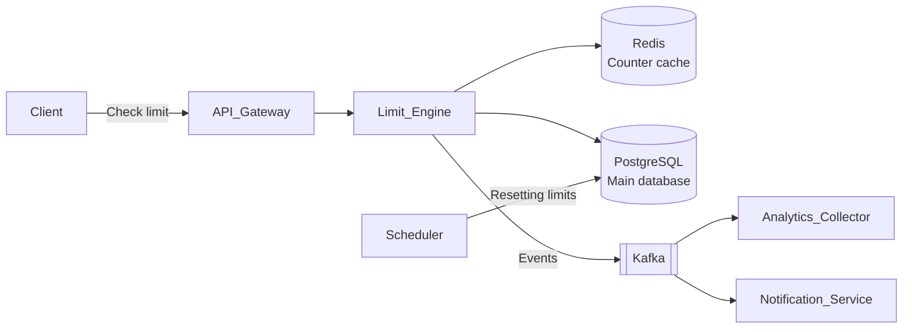

# Components

```mermaid
flowchart LR
  Client -->|Check limit| API_Gateway
  API_Gateway --> Limit_Engine
  Limit_Engine --> Redis[(Redis\nCounter cache)]
  Limit_Engine --> PostgreSQL[(PostgreSQL\nMain database)]
  Limit_Engine -->|Events| Kafka[[Kafka]]
  Kafka --> Analytics_Collector
  Kafka --> Notification_Service
  Scheduler -->|Resetting limits| PostgreSQL
```